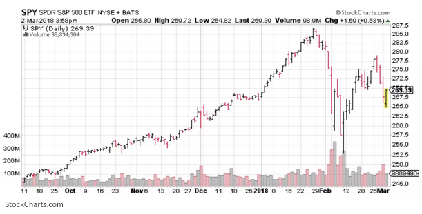

# Financial and Trading Context

- Trade generally refers to exchanging goods and services, most often in return for money [Trade](https://www.investopedia.com/terms/t/trade.asp). However, trade could be taken place between trading countries so that it is beneficial to all parties. 

- OHLC is a chart which show open, close price, and high or low price for given period [OHLC](https://www.investopedia.com/terms/o/ohlcchart.asp). Therefore, it could be applied timeframe. The vertical line represents the high or low for the period, so the left marks open price, while the right marks closing price. The bar is often black if the close is above the open, and the bar is often red if the close is below the open

- Order Book is the list of order buying or selling some stuff. The order books are used by almost for exchange of different assets like stocks, currency even cryptocurrencies. Therefore, it presents the transparency of market including price, availability. There are 3 parts to an order book: buy order, sell order, and order history. [Order Book](https://www.investopedia.com/terms/o/order-book.asp)

- Derivatives. Their value comes from the fluctuations of the values of underlying assets. Therefore, they are used by organization to mitigate risk or speculate on price changes. [Derivatives](https://www.investopedia.com/terms/d/derivative.asp)

- Cross rate: It is a exchange rate between 2 currencies, one of them are not dosmestice currency. In practices, a cross rate is usually a currency pair that doesn't involve the U.S. dollar. [Cross rate](https://www.investopedia.com/terms/c/crossrate.asp)