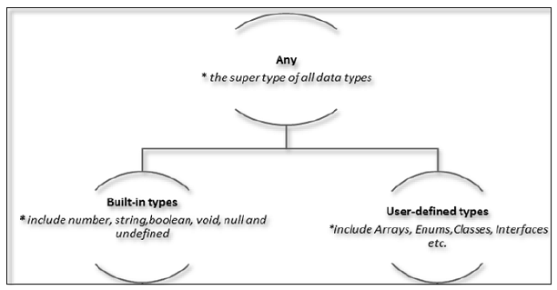

https://www.tutorialspoint.com/typescript/typescript_functions.htm
https://medium.com/javascript-in-plain-english/typescript-with-node-and-express-js-why-when-and-how-eb6bc73edd5d
https://www.tutorialspoint.com/typescript/typescript_modules.htm

# Types


# Function

```typescript
function function_name(): return_type {
   //statements
   return value;
}
```

```typescript
//function defined
function greet():string { //the function returns a string
   return "Hello World"
}

function caller() {
   var msg = greet() //function greet() invoked
   console.log(msg)
}

//invoke function
caller()

```

## Optional Parameters
```typescript
function disp_details(id:number,name:string,mail_id?:string) {
   console.log("ID:", id);
   console.log("Name",name);

   if(mail_id!=undefined)
   console.log("Email Id",mail_id);
}
disp_details(123,"John");
disp_details(111,"mary","mary@xyz.com");
```

## Rest Parameters
```typescript
function addNumbers(...nums:number[]) {
   var i;
   var sum:number = 0;

   for(i = 0;i<nums.length;i++) {
      sum = sum + nums[i];
   }
   console.log("sum of the numbers",sum)
}
addNumbers(1,2,3)
addNumbers(10,10,10,10,10)
```

## Default Parameters
```typescript
function calculate_discount(price:number,rate:number = 0.50) {
   var discount = price * rate;
   console.log("Discount Amount: ",discount);
}
calculate_discount(1000)
calculate_discount(1000,0.30)
```

## Anonymous Function

```typescript
var res = function( [arguments] ) { ... }

var msg = function() {
   return "hello world";
}
console.log(msg())
// hello world


var res = function(a:number,b:number) {
   return a*b;
};
console.log(res(12,2))

```

```typescript

import pino from "pino";
import { getEnv } from "./environment";

// -------------------------------------------------------------------------------------------------
const logger = pino({
  level: getEnv("LOG_LEVEL", "info") as string,
  name: getEnv("APP_ID", "application_id") as string,
});

// -------------------------------------------------------------------------------------------------
export default logger;

```

## The Function Constructor

```typescript
var myFunction = new Function("a", "b", "return a * b");
var x = myFunction(4, 3);
console.log(x);
```

## Recursion and TypeScript Functions

```typescript
function factorial(number) {
   if (number <= 0) {         // termination case
      return 1;
   } else {
      return (number * factorial(number - 1));     // function invokes itself
   }
};
console.log(factorial(6));      // outputs 72

// Anonymous Recursive Function
(function () {
   var x = "Hello!!";
   console.log(x)
})()      // the function invokes itself using a pair of parentheses ()

// >>> Hello!!
```

## Lambda Functions

```typescript
( [param1, parma2,…param n] ) => statement;

var foo = (x:number) => 10 + x
console.log(foo(100))      //outputs 110
```


```typescript
( [param1, parma2,…param n] )=> {

   //code block
}

var foo = (x:number)=> {
   x = 10 + x
   console.log(x)
}
foo(100)
// >>> 110

var display = x => {
   console.log("The function got "+x)
}
display(12)


```

## Syntactic Variations


```typescript
var func = (x)=> {
   if(typeof x=="number") {
      console.log(x+" is numeric")
   } else if(typeof x=="string") {
      console.log(x+" is a string")
   }
}
func(12)
func("Tom")
```

## Function Overloads

```typescript
function disp(s1:string):void;
function disp(n1:number,s1:string):void;

function disp(x:any,y?:any):void {
   console.log(x);
   console.log(y);
}
disp("abc")
disp(1,"xyz");
/*
abc
1
xyz
*/
```

# Array

```typescript
var alphas:string[];
alphas = ["1","2","3","4"]
console.log(alphas[0]);
console.log(alphas[1]);

var nums:number[] = [1,2,3,3]
console.log(nums[0]);
console.log(nums[1]);
console.log(nums[2]);
console.log(nums[3]);
```

## Array Object

```typescript
var arr_names:number[] = new Array(4)
for(var i = 0;i<arr_names.length;i++;) {
   arr_names[i] = i * 2
   console.log(arr_names[i])
}

var names:string[] = new Array("Mary","Tom","Jack","Jill")
for(var i = 0;i<names.length;i++) {
   console.log(names[i])
}
/*
Mary
Tom
Jack
Jill
*/
```

## Array Destructuring

```typescript
var arr:number[] = [12,13]
var[x,y] = arr
console.log(x)
console.log(y)
/*
12
13
*/
```

## Array Traversal using for…in loop

```typescript
var j:any;
var nums:number[] = [1001,1002,1003,1004]

for(j in nums) {
   console.log(nums[j])
}
/*
1001
1002
1003
1004
*/
```

# Tuples
## Accessing values in Tuples

```
var mytuple = [10,"Hello"]; //create a  tuple
console.log(mytuple[0])
console.log(mytuple[1])

var tup = []
tup[0] = 12
tup[1] = 23

console.log(tup[0])
console.log(tup[1])
```

## Tuple Operations

The push() appends an item to the tuple
The pop() removes and returns the last value in the tuple

```typescript
var mytuple = [10,"Hello","World","typeScript"];
console.log("Items before push "+mytuple.length)    // returns the tuple size

mytuple.push(12)                                    // append value to the tuple
console.log("Items after push "+mytuple.length)
console.log("Items before pop "+mytuple.length)
console.log(mytuple.pop()+" popped from the tuple") // removes and returns the last item

console.log("Items after pop "+mytuple.length)

/*
Items before push 4
Items after push 5
Items before pop 5
12 popped from the tuple
Items after pop 4
*/
```

## Updating Tuples

```typescript
var mytuple = [10,"Hello","World","typeScript"]; //create a  tuple
console.log("Tuple value at index 0 "+mytuple[0])

//update a tuple element
mytuple[0] = 121
console.log("Tuple value at index 0 changed to " + mytuple[0])
```

## Destructuring a Tuple

Destructuring refers to breaking up the structure of an entity. TypeScript supports destructuring when used in the context of a tuple.

```typescript
var a =[10,"hello"]
var [b,c] = a
console.log( b )
console.log( c )
/*
10
hello
*/
```

# Union

```typescript
var val:string|number
val = 12
console.log("numeric value of val "+val)
val = "This is a string"
console.log("string value of val "+val)
/*
numeric value of val  12
string value of val this is a string
*/
```

## Union Type and function parameter

```typescript
function disp(name:string|string[]) {
   if(typeof name == "string") {
      console.log(name)
   } else {
      var i;

      for(i = 0;i<name.length;i++) {
         console.log(name[i])
      }
   }
}
disp("mark")
console.log("Printing names array....")
disp(["Mark","Tom","Mary","John"])
```

```typescript
var arr:number[]|string[];
var i:number;
arr = [1,2,4]
console.log("**numeric array**")

for(i = 0;i<arr.length;i++) {
   console.log(arr[i])
}

arr = ["Mumbai","Pune","Delhi"]
console.log("**string array**")

for(i = 0;i<arr.length;i++) {
   console.log(arr[i])
}
```

# Interfaces
An interface is a syntactical contract that an entity should conform to

## Declaring Interfaces
```typescript
interface interface_name {
}

interface IPerson {
   firstName: string,
   lastName: string,
   sayHi: () => string
}

var customer:IPerson = {
   firstName: "Tom",
   lastName: "Hanks",
   sayHi: ():string => {return "Hi there"}
}

console.log("Customer Object ")
console.log(customer.firstName)
console.log(customer.lastName)
console.log(customer.sayHi())

var employee:IPerson = {
   firstName:"Jim",
   lastName:"Blakes",
   sayHi: ():string =>{return "Hello!!!"}
}

console.log("Employee  Object ")
console.log(employee.firstName);
console.log(employee.lastName);
```

## Union Type and Interface

```typescript
interface RunOptions {
   program: string;
   commandline: string[]|string|(() => string);
}

//commandline as string
var options:RunOptions = {program:"test1",commandline:"Hello"};
console.log(options.commandline)

//commandline as a string array
options = {program:"test1",commandline:["Hello","World"]};
console.log(options.commandline[0]);
console.log(options.commandline[1]);

//commandline as a function expression
options = {program:"test1",commandline:() => {return "**Hello World**";}};

var fn:any = options.commandline;
console.log(fn());

/*
Hello
Hello
World
**Hello World**
*/
```

## Interfaces and Arrays

```typescript
interface namelist {
   [index:number]: string
}

var list2:namelist = ["John",1,"Bran"] //Error. 1 is not type string


interface ages {
   [index:string]: number
}

var agelist:ages;
agelist["John"] = 15   // Ok
agelist[2] = "nine"   // Error
```

## Interfaces and Inheritance

```typescript
interface Person {
   age:number
}

interface Musician extends Person {
   instrument:string
}

var drummer = <Musician>{};
drummer.age = 27
drummer.instrument = "Drums"
console.log("Age:  "+drummer.age) console.log("Instrument:  "+drummer.instrument)
```

## Multiple Interface Inheritance

```typescript
interface IParent1 {
   v1:number
}

interface IParent2 {
   v2:number
}
/*
Age: 27
Instrument: Drums
*/

interface Child extends IParent1, IParent2 { }
var Iobj:Child = { v1:12, v2:23}
console.log("value 1: "+this.v1+" value 2: "+this.v2)
/*
value 1: 12   value 2: 23
*/
```

# Classes

## Creating classes


```typescript
class class_name {
   //class scope
}

class Person {
}

class Car {

   //field
   engine:string;

   //constructor
   constructor(engine:string) {
      this.engine = engine
   }

   //function
   disp():void {
      console.log("Engine is  :   "+this.engine)
   }
}
```

## Creating classes 2

```typescript
// -------------------------------------------------------------------------------------------------

import kafka, { ConsumerGroupOptions } from "kafka-node";
import { Logger } from "pino";

import { getEnv } from "./environment";

// -------------------------------------------------------------------------------------------------

enum Offset {
  "earliest",
  "latest",
  "none",
}

const kafkaSettings: ConsumerGroupOptions = {
  fromOffset: getEnv("KAFKA_FROM_OFFSET", "latest") as keyof typeof Offset,
  groupId: getEnv("KAFKA_GROUP_ID", "default_group_id") as string,
  kafkaHost: getEnv("KAFKA_BROKERS", "localhost:9092") as string,
  protocol: ["roundrobin"],
  sessionTimeout: 15000,
};

// -------------------------------------------------------------------------------------------------

export default class KafkaConsumer {

  public ready: boolean;

  private consumer: kafka.ConsumerGroup;

  private name: string;

  constructor(
    name: string,
    logger: Logger,
    topics: string | string[],
    visitor: (topic: string, message: any) => Promise<void>,
    uniqueConsumerGroup = true,
  ) {
    this.name = name;
    this.ready = false;
    const consumerSettings = { ...kafkaSettings };

    consumerSettings.groupId = uniqueConsumerGroup
      ? `${consumerSettings.groupId}_${Date.now()}_${Math.random()}`
      : consumerSettings.groupId;

    this.consumer = new kafka.ConsumerGroup(consumerSettings, topics);

    logger.info(`Kafka Consumer listening on topics '${topics}'...`);

    this.consumer.on("connect", () => {
      logger.info(`Kafka client ${this.name} connected.`);
      this.ready = true;
    });

    this.consumer.on("message", async message => {
      // l.debug(`Received a new message from Kafka on topic ${topics}: ${message.value}`)

      if (!message.topic) {
        logger.error(`Message does not have a topic: ${JSON.stringify(message)}`);
        return;
      }
      if (!message.value) {
        logger.error(`Empty message on topic ${message.topic}, skipping.`);
        return;
      }

      const value = JSON.parse(message.value.toString());

      await visitor(message.topic, value);
    });

    this.consumer.on("error", error => {
      logger.error(`Kafka consumer error for topic(s) ${topics}, error is ${error}.`);
    });

    return this;
  }
}
```
## Creating Instance objects

```typescript
var obj = new Car("Engine 1")

class Car {
   //field
   engine: string;

   //constructor
   constructor(engine: string) {
      this.engine = engine
   }

   //function
   disp(): void {
      console.log("Function displays Engine is  :   "+this.engine)
   }
}

//create an object
var obj = new Car("XXSY1")

//access the field
console.log("Reading attribute value Engine as :  "+obj.engine)

//access the function
obj.disp()
```

## Class Inheritance

```typescript
class Shape {
   Area:number

   constructor(a:number) {
      this.Area = a
   }
}

class Circle extends Shape {
   disp():void {
      console.log("Area of the circle:  "+this.Area)
   }
}
```


```typescript
var obj = new Circle(223);
obj.disp()


class Root {
   str:string;
}

class Child extends Root {}
class Leaf extends Child {} //indirectly inherits from Root by virtue of inheritance

var obj = new Leaf();
obj.str ="hello"
console.log(obj.str)
```

## TypeScript ─ Class inheritance and Method Overriding

```typescript
class PrinterClass {
   doPrint():void {
      console.log("doPrint() from Parent called…")
   }
}

class StringPrinter extends PrinterClass {
   doPrint():void {
      super.doPrint()
      console.log("doPrint() is printing a string…")
   }
}

var obj = new StringPrinter()
obj.doPrint()
// doPrint() from Parent called…
// doPrint() is printing a string…
```

## The static Keyword

```typescript
class StaticMem {
   static num:number;

   static disp():void {
      console.log("The value of num is"+ StaticMem.num)
   }
}

StaticMem.num = 12      // initialize the static variable
StaticMem.disp()        // invoke the static method

```

## The instanceof operator

```typescript
class Person { }
var obj = new Person()
var isPerson = obj instanceof Person;
console.log(" obj is an instance of Person " + isPerson)
// obj is an instance of Person True
```


## Data Hiding
- public: A public data member has universal accessibility. Data members in a class are public by default.
- private: Private data members are accessible only within the class that defines these members. If an external class member tries to access a private member, the compiler throws an error.
- protected:  A protected data member is accessible by the members within the same class as that of the former and also by the members of the child classes

```typescript
class Encapsulate {
   str:string = "hello"
   private str2:string = "world"
}

var obj = new Encapsulate()
console.log(obj.str)     //accessible
console.log(obj.str2)   //compilation Error as str2 is private
```

## Classes and Interfaces


```typescript
interface ILoan {
   interest: number
}

class AgriLoan implements ILoan {
   interest:number
   rebate:number

   constructor(interest:number,rebate:number) {
      this.interest = interest
      this.rebate = rebate
   }
}

var obj = new AgriLoan(10,1)
console.log("Interest is : "+obj.interest+" Rebate is : "+obj.rebate )
/*
Interest is : 10 Rebate is : 1
*/
```

# Objects

```typescript
var object_name = {
   key1: “value1”, //scalar value
   key2: “value”,
   key3: function() {
      //functions
   },
   key4:[“content1”, “content2”] //collection
};
```

## Object Literal Notation


```typescript
var person = {
   firstname:"Tom",
   lastname:"Hanks"
};
//access the object values
console.log(person.firstname)
console.log(person.lastname)
```

## TypeScript Type Template

```typescript
var person = {
   firstName:"Tom",
   lastName:"Hanks",
   sayHello:function() {  }  //Type template
}
person.sayHello = function() {
   console.log("hello "+person.firstName)
}
person.sayHello()

/*
hello Tom
*/
```

## Anonymous Object

```typescript
var invokeperson = function(obj:{ firstname:string, lastname :string}) {
   console.log("first name :"+obj.firstname)
   console.log("last name :"+obj.lastname)
}
invokeperson({firstname:"Sachin",lastname:"Tendulkar"});
/*
first name :Sachin
last name :Tendulkar
*/
```

## Duck-typing

```typescript
interface IPoint {
   x:number
   y:number
}

function addPoints(p1:IPoint,p2:IPoint):IPoint {
   var x = p1.x + p2.x
   var y = p1.y + p2.y
   return {x:x,y:y}
}

//Valid
var newPoint = addPoints({x:3,y:4},{x:5,y:1})

//Error
var newPoint2 = addPoints({x:1},{x:4,y:3})
```

# Namespaces

## Defining a Namespace

```typescript
namespace SomeNameSpaceName {
   export interface ISomeInterfaceName {      }
   export class SomeClassName {      }
}

SomeNameSpaceName.SomeClassName;
```


```typescript
/// <reference path = "IShape.ts" />

namespace Drawing {
  export class Circle implements IShape {
    public draw() {
        console.log("Circle is drawn");
    }

    FileName :Triangle.ts
    ----------
    /// <reference path = "IShape.ts" />
    namespace Drawing {
        export class Triangle implements IShape {
          public draw() {
              console.log("Triangle is drawn");
          }
        }

        FileName : TestShape.ts
        /// <reference path = "IShape.ts" />
        /// <reference path = "Circle.ts" />
        /// <reference path = "Triangle.ts" />
        function drawAllShapes(shape:Drawing.IShape) {
          shape.draw();
        }
        drawAllShapes(new Drawing.Circle());
        drawAllShapes(new Drawing.Triangle());
    }
  }
}
```

```bash
tsc --out app.js TestShape.ts
node app.js
```

/*
Circle is drawn
Triangle is drawn
*/

## Nested Namespaces


```typescript
namespace namespace_name1 {
   export namespace namespace_name2 {
      export class class_name {    }
   }
}
```


```typescript
FileName : Invoice.ts
namespace tutorialPoint {
   export namespace invoiceApp {
      export class Invoice {
         public calculateDiscount(price: number) {
            return price * .40;
         }
      }
   }
}
FileName: InvoiceTest.ts

/// <reference path = "Invoice.ts" />
var invoice = new tutorialPoint.invoiceApp.Invoice();
console.log(invoice.calculateDiscount(500));
// >>> 200
```

# Module

## Internal Module

```typescript
namespace TutorialPoint {
   export function add(x, y) { console.log(x + y);}
}
```

## External Module

```typescript
//FileName : SomeInterface.ts
export interface SomeInterface {
   //code declarations
}
```

```typescript
import someInterfaceRef = require(“./SomeInterface”);
```

```typescript
import { getEnv, getEnvAsInteger } from "./environment";
import { Pool, PoolConfig, QueryArrayResult, QueryResult, QueryResultRow } from "pg";
import QueryManager from "./queryManager";
```

```typescript
// IShape.ts
export interface IShape {
   draw();
}

// Circle.ts
import shape = require("./IShape");
export class Circle implements shape.IShape {
   public draw() {
      console.log("Cirlce is drawn (external module)");
   }
}

// Triangle.ts
import shape = require("./IShape");
export class Triangle implements shape.IShape {
   public draw() {
      console.log("Triangle is drawn (external module)");
   }
}

// TestShape.ts
import shape = require("./IShape");
import circle = require("./Circle");
import triangle = require("./Triangle");

function drawAllShapes(shapeToDraw: shape.IShape) {
   shapeToDraw.draw();
}

drawAllShapes(new circle.Circle());
drawAllShapes(new triangle.Triangle())

/*
Cirlce is drawn (external module)
Triangle is drawn (external module)
*/
```

```typescript
// environment.ts
export function getEnv(name: string, defaultValue?: string | null): string | null {
  const value = process.env[name];
  if (value === undefined) {
    if (defaultValue !== undefined) return defaultValue;
    throw new Error(`Missing environment variable '${name}'.`);
  }
  return value;
}

export function getEnvAsBoolean(name: string, defaultValue?: string | boolean | null): boolean | null {
  const value = getEnv(name, typeof defaultValue === "boolean" ? defaultValue.toString() : defaultValue);
  return value ? value === "true" : false;
}

export function getEnvAsInteger(name: string, defaultValue?: string | number | null): number | null {
  const value = getEnv(name, typeof defaultValue === "number" ? defaultValue.toString() : defaultValue);
  if (value === null) return null;
  const integer = parseInt(value, 10);
  if (Number.isNaN(integer)) throw Error(`Environment variable '${name}' is not a number (${value}).`);
  return integer;
}

// kafkaConsumer.ts
import { getEnv } from "./environment";

// ------------------------------------------------------------------------------------------------

enum Offset {
  "earliest",
  "latest",
  "none",
}

const kafkaSettings: ConsumerGroupOptions = {
  fromOffset: getEnv("KAFKA_FROM_OFFSET", "latest") as keyof typeof Offset,
  groupId: getEnv("KAFKA_GROUP_ID", "default_group_id") as string,
  kafkaHost: getEnv("KAFKA_BROKERS", "localhost:9092") as string,
  protocol: ["roundrobin"],
  sessionTimeout: 15000,
};
```
